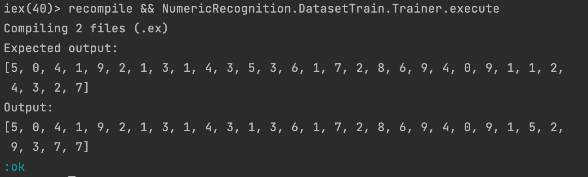

# Elixir Neural Network labs
Elixir implementation of MNIST and CIFAR10 neural networks

## Installation

```elixir
def deps do
  [
    {:elixir_neural_network_labs, "~> 0.1.0"}
  ]
end
```

## Prerequisite for EXLA

Bazel 3.7.2<br>
>asdf plugin add bazel<br>
asdf install bazel 3.7.2<br>
asdf global bazel 3.7.2<br>

Erlang OTP 24 (MacOS)
>brew install erlang

Erlang OTP 24 (ASDF)
>asdf plugin add erlang 24.0.6<br>
asdf install erlang 24.0.6<br>
asdf global erlang 24.0.6<br>

Elixir 1.12
>asdf plugin add elixir<br>
asdf install elixir 1.12-otp-24<br>
asdf global elixir 1.12-otp-24<br>

Python
>sudo apt install python3-pip<br>

Some trickery to when calling python it uses python3 as default (maybe not the best way to do this, but it works)
>cd /usr/bin<br>
sudo ln -s python3 python<br>

NumPy
>pip3 install numpy<br>

## Starting project

Add the following env-vars:

>export XLA_BUILD=false<br>
export XLA_TARGET=cuda<br>
export EXLA_TARGET=cuda<br>
export EXLA_FLAGS=--config=cuda<br>
export TF_CUDA_VERSION='YOUR_CUDA_VERSION'

>`mix deps.get`<br>
`mix compile`

Be aware that `EXLA` takes a really long time to compile if your machine XLA version was not already pre-compiled.
Usually `CUDA` in version `1.11+` have their `XLA` already compiled to be downloaded and everything runs smoothly.

## Execution

> iex -S mix
<br>
iex(1)> MNIST.Executor.execute()
<br>
iex(2)> CIFAR10.Executor.execute()

## Current status:
### - MNIST
Status: **Working**


<br>
<br>
<br>

- CIFAR10: Not Working
### - CIFAR10
Status: **Not Working**
