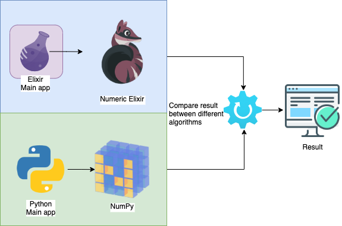

# Elixir vs Python Neural Network comparison

*Author: Lucas Campos Tavano*

Final paper of the Computer Engineering course at the Federal Technological University of Paraná (UTFPR)

## Description
This project's goal is to compare neural networks algorithms performances using [Elixir](https://elixir-lang.org/) with [Nx](https://github.com/elixir-nx/nx) library and [Python](https://www.python.org/) with [NumPy](https://numpy.org/) library
## Main diagram

