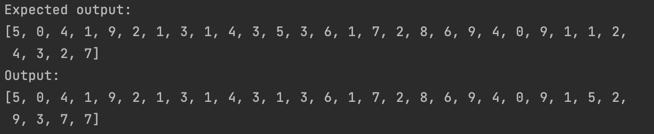

# MNIST experiment

This Axon model classifies handwritten digits from the MNIST dataset. The maintained training code is in [`mnist.ex`](mnist.ex); setup and execution commands are in the [repository README](../../../../README.md).

The figure belongs to the original capstone project. It was not regenerated with the current Elixir, Nx, and EXLA versions. The initial implementation drew on [José Valim's Nx tutorial](https://www.youtube.com/watch?v=fPKMmJpAGWc).
