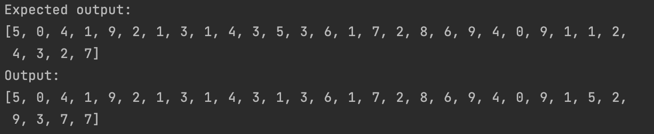

# Image Recognition Neural Network (IRNW) - MNIST

 This is an implementation using Elixir NX to solve MNIST problem, which consists in recognizing handwritten numbers.

#Results:

- This project got created using [José Valim's Tutorial](https://www.youtube.com/watch?v=fPKMmJpAGWc). Every code currently in this project is inspired in his tutorial.